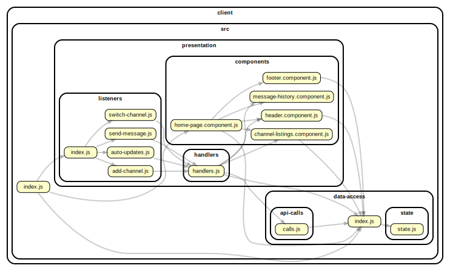

<!-- BEGIN title -->

# CLIENT

<!-- END title -->

<!-- BEGIN TREE -->

<!-- END TREE -->

<!-- BEGIN TOC -->

- src
  - data-access
    - api-calls
      - [calls.js](#clientsrcdata-accessapi-callscallsjs)
    - state
      - [state.js](#clientsrcdata-accessstatestatejs)
    - [index.js](#clientsrcdata-accessindexjs)
  - presentation
    - components
      - [channel-listings.component.js](#clientsrcpresentationcomponentschannel-listingscomponentjs)
      - [footer.component.js](#clientsrcpresentationcomponentsfootercomponentjs)
      - [header.component.js](#clientsrcpresentationcomponentsheadercomponentjs)
      - [home-page.component.js](#clientsrcpresentationcomponentshome-pagecomponentjs)
      - [message-history.component.js](#clientsrcpresentationcomponentsmessage-historycomponentjs)
    - handlers
      - [handlers.js](#clientsrcpresentationhandlershandlersjs)
    - listeners
      - [add-channel.js](#clientsrcpresentationlistenersadd-channeljs)
      - [auto-updates.js](#clientsrcpresentationlistenersauto-updatesjs)
      - [index.js](#clientsrcpresentationlistenersindexjs)
      - [send-message.js](#clientsrcpresentationlistenerssend-messagejs)
      - [switch-channel.js](#clientsrcpresentationlistenersswitch-channeljs)
  - [index.js](#clientsrcindexjs)
- styles

---

<!-- END TOC -->

---

<!-- BEGIN DOCS -->

# /src

## /data-access

### /api-calls

<a href="../../client/src/data-access/api-calls/calls.js" id="clientsrcdata-accessapi-callscallsjs">../client/src/data-access/api-calls/calls.js</a>

---

### /state

<a href="../../client/src/data-access/state/state.js" id="clientsrcdata-accessstatestatejs">../client/src/data-access/state/state.js</a>

---

<a href="../../client/src/data-access/index.js" id="clientsrcdata-accessindexjs">../client/src/data-access/index.js</a>

---

## /presentation

### /components

<a href="../../client/src/presentation/components/channel-listings.component.js" id="clientsrcpresentationcomponentschannel-listingscomponentjs">../client/src/presentation/components/channel-listings.component.js</a>

<a href="../../client/src/presentation/components/footer.component.js" id="clientsrcpresentationcomponentsfootercomponentjs">../client/src/presentation/components/footer.component.js</a>

<a href="../../client/src/presentation/components/header.component.js" id="clientsrcpresentationcomponentsheadercomponentjs">../client/src/presentation/components/header.component.js</a>

<a href="../../client/src/presentation/components/home-page.component.js" id="clientsrcpresentationcomponentshome-pagecomponentjs">../client/src/presentation/components/home-page.component.js</a>

<a href="../../client/src/presentation/components/message-history.component.js" id="clientsrcpresentationcomponentsmessage-historycomponentjs">../client/src/presentation/components/message-history.component.js</a>

---

### /handlers

<a href="../../client/src/presentation/handlers/handlers.js" id="clientsrcpresentationhandlershandlersjs">../client/src/presentation/handlers/handlers.js</a>

---

### /listeners

<a href="../../client/src/presentation/listeners/add-channel.js" id="clientsrcpresentationlistenersadd-channeljs">../client/src/presentation/listeners/add-channel.js</a>

<a href="../../client/src/presentation/listeners/auto-updates.js" id="clientsrcpresentationlistenersauto-updatesjs">../client/src/presentation/listeners/auto-updates.js</a>

<a href="../../client/src/presentation/listeners/index.js" id="clientsrcpresentationlistenersindexjs">../client/src/presentation/listeners/index.js</a>

<a href="../../client/src/presentation/listeners/send-message.js" id="clientsrcpresentationlistenerssend-messagejs">../client/src/presentation/listeners/send-message.js</a>

<a href="../../client/src/presentation/listeners/switch-channel.js" id="clientsrcpresentationlistenersswitch-channeljs">../client/src/presentation/listeners/switch-channel.js</a>

---

---

<a href="../../client/src/index.js" id="clientsrcindexjs">../client/src/index.js</a>

---

# /styles

---

<!-- END DOCS -->
